# 🗺️ System Architecture Documentation

This document provides a deep-dive architectural breakdown of the **Self-Healing Code Engine** state machine. It maps out how the system handles isolated code execution, context window preservation, and multi-block patch application across recurring graph loops.

---

## 🧭 The Computational Graph

The system is engineered as a Finite State Machine (FSM) utilizing LangGraph. Instead of traditional linear chatting, execution flow is conditionally routed through dedicated processing nodes based on runtime exit status and semantic assertions.



### 🧠 Algorithmic Strategy: Localized Fuzzy Indexing
To avoid the token bloat of sending entire files for Search-and-Replace, this engine utilizes a highly lightweight list-slicing method. 

The LLM outputs a single target index, a line count, a character count checksum, and exactly two unique anchor words. The ```update_source_code``` node searches a localized sliding window ($\pm 5$ lines) to calculate a similarity score. This guarantees pinpoint targeting even if the LLM hallucinates or misses the exact index position, saving up to 90% of structural token overhead.

---

## 🗂️ Architectural Blueprints

### 1. Centralized State Layout (```AgentState```)
The LangGraph shared memory object is structured to maintain a clean history of mutations without overloading the context window:

* ```source_code``` (List[str]): The active target codebase, stored line-by-line in system memory.
* ```count``` (int): Safety execution boundary to prevent runaway loops and control API expenditures.
* ```changes``` (List[Dict]): An append-only chronological ledger tracking patch attempts:
    ```json
    {
      "edits": [
        {
          "start_line_index": 15,
          "lines_to_delete": 4,
          "block_character_length": 84,
          "keywords": ["def", "calculate_metrics"],
          "new_lines": [
            "    if not data: return 0",
            "    return sum(data) / len(data)"
          ]
        }
      ],
      "has_error": true,
      "error_message": "ZeroDivisionError: division by zero on line 16"
    }
    ```

### 2. Functional Node Specification
* **```query_llm```**: Extracts the base ```source_code``` and the last 3 elements of the ```changes``` ledger to compile a stateless, single-turn inference prompt.
* **```update_source_code```**: A pure Python data utility. Processes incoming batch edits in sequential order, dynamically updating a running index offset based on the lines added or deleted by previous edits. This keeps subsequent target coordinates perfectly aligned before mutating the code list slices.
* **```execute_code```**: Writes the code string array to a temporary environment file and runs it inside a restricted ```subprocess.run()``` instance with strict timeout tracking.
* **```semantic_validator```**: Triggers only on successful execution loops to cross-examine the script structure and logic output against the initial user requirements.

---

## 🚦 Edge Routing Matrix

### ```review_results``` (Conditional Edge)
Evaluates the immediate physical outcome of the subprocess environment execution pass by checking the last entry in the ```changes``` list.
* If ```changes[-1]["has_error"] == True``` $\rightarrow$ Routes immediately back to ```query_llm``` using the captured ```error_message```.
* If ```changes[-1]["has_error"] == False``` $\rightarrow$ Routes forward to ```semantic_validator```.

### ```route_after_validation``` (Conditional Edge)
Evaluates the logical review findings generated by the semantic analysis node pass.
* If the LLM validator confirms the code matches user intent $\rightarrow$ Exits the graph loop to ```END```.
* If the LLM validator flags a logical flaw $\rightarrow$ Appends the critique to the ```changes``` ledger and routes back to ```query_llm```.